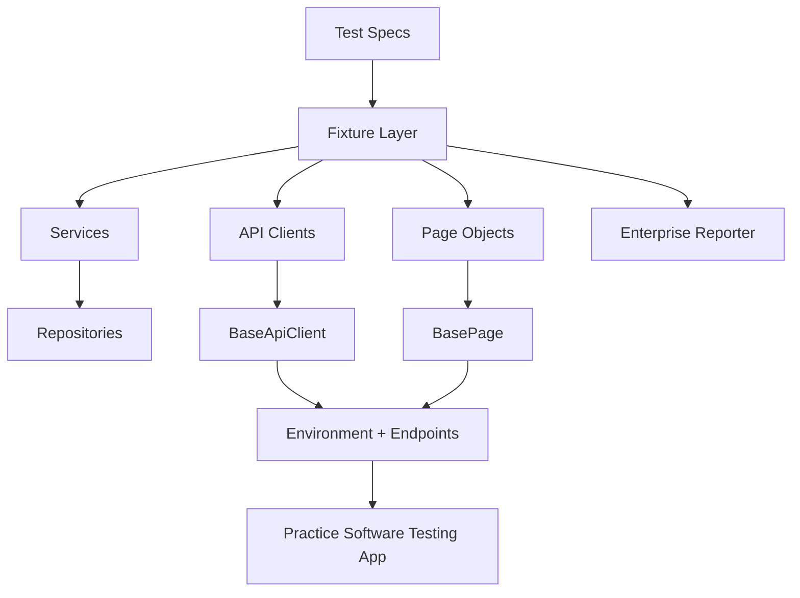

# Complete Architecture and Test Execution Guide

This document is the single reference for how this framework runs tests, what features it provides, and how to add new tests safely.

## 1) Framework Purpose

This repository is an enterprise Playwright + TypeScript framework for:

- UI testing
- API testing
- Hybrid testing (API + UI in one scenario)
- Visual regression testing
- Cross-browser and mobile-emulated execution

Application under test:

- UI: https://practicesoftwaretesting.com
- API: https://api.practicesoftwaretesting.com
- Swagger: https://api.practicesoftwaretesting.com/api/documentation

## 2) High-Level Architecture



## 3) Execution Lifecycle End to End

### 3.1 Configuration and Environment Bootstrap

1. Playwright loads `playwright.config.ts`.
2. Environment values are parsed and validated by `src/config/environment.ts`.
3. Global timeout, expect timeout, baseURL, action timeout, and navigation timeout are applied.
4. Reporter chain is selected based on local/CI mode.

Defaults include:

- `UI_BASE_URL`: https://practicesoftwaretesting.com
- `API_BASE_URL`: https://api.practicesoftwaretesting.com
- `TEST_TIMEOUT_MS`: 30000

### 3.2 Global Setup

Before tests, `src/setup/global-setup.ts` ensures required folders exist:

- `test-results`
- `playwright/.auth`

### 3.3 Project Matrix and Dependencies

Defined in `playwright.config.ts`:

- setup
- chromium-desktop
- firefox-desktop
- webkit-desktop
- pixel-5
- iphone-13
- chromium-authenticated-customer (depends on setup)
- chromium-authenticated-admin (depends on setup)

The setup project runs `src/setup/auth-setup.ts` and writes storage states for customer and admin users. Dependent authenticated projects consume those state files.

### 3.4 Fixture Construction

`src/fixtures/test-fixtures.ts` creates dependency-injected fixtures for:

- API clients (authApi, productsApi, cartsApi, usersApi, etc.)
- UI page objects (homePage, loginPage, productsPage, productPage, cartPage, checkoutPage)

`src/fixtures/authenticated-fixtures.ts` extends base fixtures with:

- `accessToken` (customer token)
- `adminToken` (admin token)

### 3.5 Test Runtime Flow

1. Test worker starts browser/context/page according to project settings.
2. If project is authenticated, storageState is preloaded.
3. Test fixtures are created.
4. Test body executes.
5. Artifacts (screenshot/video/trace) are captured according to config.
6. Built-in reporters and enterprise reporter persist results.

### 3.6 Reporting

`src/reporters/enterprise-reporter.ts` writes:

- `test-results/summary.md` with per-test status and durations

Also emits default Playwright reporters:

- local: line + html + enterprise reporter
- CI: list + json + junit + enterprise reporter

## 4) Core Building Blocks

### 4.1 Configuration

- `src/config/environment.ts`: strongly validates env vars with Zod
- `src/config/endpoints.ts`: central endpoint map for API routes
- `src/config/test-data.ts`: shared users and payment defaults
- `src/config/auth-state.ts`: storageState file locations

### 4.2 Core Layer

- `src/core/base-page.ts`: shared UI actions (`goto`, locator helpers)
- `src/core/base-api-client.ts`: generic HTTP methods and consistent error handling
- `src/core/logger.ts`: logging helper

### 4.3 API Layer

Clients in `src/api` expose domain-specific methods for auth, carts, products, users, invoices, reports, favorites, and more.

Shared helpers in `src/api/api-utils.ts`:

- `bearerHeaders(token)` for Authorization header
- `toQueryString(params)` for optional query parameter serialization

### 4.4 UI Layer

Page objects in `src/pages` encapsulate selectors and user actions.

Pattern:

1. open page
2. perform action
3. assert outcome

### 4.5 Service and Repository Layers

- Services orchestrate multi-client workflows (auth, catalog, checkout).
- Repositories provide intent-focused data access patterns for test logic stability.

### 4.6 Utilities

- `src/utils/assertions.ts`: reusable assertions
- `src/utils/data-factory.ts`: test data builders (faker)
- `src/utils/screenshot.ts`: standardized screenshot helpers
- `src/utils/tracing.ts`: trace helpers

## 5) Complete Test Execution Flows by Test File

This section documents current flows for every test file under `tests`.

### 5.1 API: tests/api/auth.spec.ts

Flow A: login with customer credentials

1. Use `authApi.login(...)`
2. Assert token type is bearer
3. Assert token length is > 10

Flow B: retrieve profile using bearer token

1. Login via `authApi.login(...)`
2. Call `authApi.me(accessToken)`
3. Assert profile email contains `@`

### 5.2 API: tests/api/cart.spec.ts

Flow: create cart and add product

1. Get products via `productsApi.getProducts()`
2. Take first product
3. Create cart via `cartsApi.createCart()`
4. Add item via `cartsApi.addItem(cart.id, {...})`
5. Assert add result contains item confirmation

### 5.3 API + Hybrid Patterns: tests/api/database-testing.spec.ts

Flow A: create user, validate, optional UI check, cleanup

1. Build user payload via data factory
2. Register via `authApi.register(...)`
3. Query user via `usersApi.getUser(...)`
4. Optionally navigate UI admin users page and check visibility
5. Delete user via `usersApi.deleteUser(...)`
6. Confirm deletion behavior

Flow B: create product, add to cart, create and verify invoice

1. Build product payload
2. Create product via `productsApi.createProduct(...)`
3. Create cart and add item
4. Read cart back
5. Create invoice via `invoicesApi.createInvoice(...)`
6. Fetch invoice and verify persistence

Flow C: bulk create users in parallel

1. Fire multiple `authApi.register(...)` calls in `Promise.all`
2. Filter successful users
3. Validate each user is queryable
4. Log cleanup intent

Flow D: transaction-like behavior on failure

1. Create cart
2. Attempt invalid product add
3. Assert failure
4. Verify cart still exists
5. Attempt cleanup removal

### 5.4 API: tests/api/json-handling.spec.ts

Flow set: JSON processing patterns

1. Deep merge nested objects
2. Extract nested values from dotted paths
3. Map/filter transformations
4. Normalize API shape to internal DTO shape
5. Handle special characters and escaping
6. Compare objects and compute diff
7. Complex collection filtering
8. Group and aggregate payloads
9. Chunk processing for large arrays
10. Circular reference-safe serialization
11. Sanitize untrusted JSON
12. Apply RFC 6902-like patch operations
13. Convert JSON <-> CSV

Note: helper functions at bottom are local to this spec and can be promoted into `src/utils` if reused.

### 5.5 API: tests/api/products.spec.ts

Flow A: retrieve catalog

1. Call `productsApi.getProducts()`
2. Assert catalog list is not empty
3. Assert current page > 0

Flow B: search by keyword

1. Call `productsApi.searchProducts("hammer")`
2. Assert result list is not empty
3. Assert at least one product includes hammer

### 5.6 API: tests/api/schema-validation.spec.ts

Flow set: schema validation patterns

1. Validate single product with Zod safeParse
2. Validate all products with strict parse
3. Deliberately detect schema violations
4. Validate nested structures
5. Coerce types (string price to number)
6. Validate array schema consistency
7. Use discriminated unions
8. Handle optional/nullable/default fields
9. Validate batch mixed-result payloads
10. Add custom refine validation

### 5.7 Hybrid: tests/hybrid/checkout.spec.ts

Flow A: seed via API, verify via UI

1. Login via API
2. Fetch product catalog via API
3. Open products UI
4. Search using product keyword

Flow B: prepare cart by API, continue checkout in UI

1. Fetch product via API
2. Create cart and add item via API
3. Navigate to checkout page in UI
4. Fill shipping address
5. Fill payment details

### 5.8 UI Authenticated: tests/ui/authenticated.spec.ts

Flow A: account page visibility for logged-in user

1. Use authenticated project/context
2. Go to `/account`
3. Verify logout link visible

Flow B: API token + UI verification for favorites

1. Get product via API
2. Add favorite via API using fresh token
3. Open favorites UI
4. Verify product visible
5. Cleanup favorite via API

Flow C: admin area accessibility check

1. Validate admin identity via API token
2. Navigate `/admin`
3. Assert not redirected to login

### 5.9 UI: tests/ui/login.spec.ts

Flow A: login from UI

1. Open login page via page object
2. Submit credentials
3. Verify authenticated state

Flow B: home page and login link

1. Open home page
2. Verify login link visible

### 5.10 UI: tests/ui/mocking.spec.ts

Flow A: slow API simulation

1. Route `**/api/products**`
2. Delay and continue
3. Validate spinner or eventual products heading

Flow B: backend failure simulation

1. Route products endpoint
2. Abort with failed
3. Validate error behavior

Flow C: canned product detail response

1. Route specific product endpoint
2. Fulfill mocked JSON
3. Verify mocked name and price in UI

Flow D: block analytics scripts

1. Route analytics domains and abort
2. Navigate home
3. Validate load time and heading visibility

Flow E: mock login endpoint

1. Intercept POST login
2. Return canned token payload
3. Perform UI login interaction
4. Assert token stored in localStorage

### 5.11 UI: tests/ui/multi-context.spec.ts

Flow A: multi-tab same context

1. Open page 1
2. Create page 2 in same context
3. Navigate both, switch fronts
4. Validate headings and close page 2

Flow B: isolated contexts

1. Create context1/context2
2. Set localStorage in context1
3. Verify absence in context2
4. Close both contexts

Flow C: shared authentication in same context

1. Verify page1 account authenticated
2. Open page2 in same context
3. Verify page2 account authenticated
4. Use API token for profile checks
5. Close page2

### 5.12 UI: tests/ui/products.spec.ts

Flow: search and open a product

1. Open products page
2. Search for hammer
3. Click first product
4. Assert heading is visible on resulting page

### 5.13 Visual: tests/visual/home.visual.spec.ts

Flow: visual baseline check

1. Open home page
2. Capture and compare full-page screenshot against `home-page.png`

## 6) Feature Catalog and How to Use Each Feature

### 6.1 Tag-Based Execution

Tags in test titles:

- `@ui`
- `@api`
- `@hybrid`
- `@visual`

Run examples:

```bash
npm run test:ui
npm run test:api
npm run test:hybrid
npm run test:visual
```

### 6.2 Cross-Browser and Mobile Emulation

Projects are preconfigured in `playwright.config.ts`.

Run a single project:

```bash
npx playwright test --project=firefox-desktop
npx playwright test --project=iphone-13
```

### 6.3 Auth Reuse with setup + storageState

- Setup project logs in via API and writes storage states.
- Authenticated projects preload that state.
- Use `authTest` fixture when both UI auth and API bearer token are required.

### 6.4 API Testing Utilities

- Use API fixtures from `test-fixtures.ts`.
- Use endpoint constants from `src/config/endpoints.ts`.
- Use `bearerHeaders` and `toQueryString` in client implementations.

### 6.5 Request Mocking

Supported via Playwright routing:

- `route.abort()`
- `route.continue()`
- `route.fulfill()`
- `route.fetch()`

### 6.6 Visual Assertions

Use Playwright snapshot assertions:

```ts
await expect(page).toHaveScreenshot("name.png", { fullPage: true });
```

### 6.7 Type Safety and Runtime Validation

- TypeScript strict mode for compile-time checks
- Zod for runtime schema validation and coercion

### 6.8 Reporting and Artifacts

- HTML report: `npm run report`
- CI: JSON + JUnit for pipeline ingestion
- Custom summary: `test-results/summary.md`
- Trace/video/screenshot retention configured in Playwright config

### 6.9 Data Factories

Use factory builders for test isolation and realistic payloads:

- `buildUser()`
- `buildProduct()`

## 7) How to Add New Tests

### 7.1 Add a New UI Test

1. Add or extend a page object in `src/pages`.
2. Keep selectors inside page object methods.
3. Add test in `tests/ui` with `@ui` tag.
4. Use fixtures from `src/fixtures/test-fixtures.ts`.

Template:

```ts
import { test, expect } from "../../src/fixtures/test-fixtures";

test("@ui user can do X", async ({ somePage }) => {
  await somePage.open();
  await somePage.doAction();
  await somePage.expectOutcome();
  expect(true).toBeTruthy();
});
```

### 7.2 Add a New API Test

1. Add endpoint in `src/config/endpoints.ts` if missing.
2. Add/extend API client in `src/api`.
3. Add models in `src/models` if new contracts are needed.
4. Create test in `tests/api` with `@api` tag.

Template:

```ts
import { test, expect } from "../../src/fixtures/test-fixtures";

test("@api should perform X", async ({ someApi }) => {
  const response = await someApi.someMethod();
  expect(response).toBeTruthy();
});
```

### 7.3 Add a New Hybrid Test

1. Prepare data with API client calls.
2. Validate or continue workflow via UI page objects.
3. Add test in `tests/hybrid` with `@hybrid` tag.
4. Clean up data where needed for idempotency.

Template:

```ts
import { test, expect } from "../../src/fixtures/test-fixtures";

test("@hybrid API prepares and UI verifies X", async ({ apiA, pageObj }) => {
  const seed = await apiA.seed();
  expect(seed).toBeTruthy();

  await pageObj.open();
  await pageObj.verifySeed(seed);
});
```

### 7.4 Add a New Visual Test

1. Place test under `tests/visual` with `@visual` tag.
2. Navigate to stable UI state.
3. Use deterministic data and viewport assumptions.
4. Add snapshot assertion.

Template:

```ts
import { test, expect } from "../../src/fixtures/test-fixtures";

test("@visual page remains stable", async ({ page }) => {
  await page.goto("/some-page");
  await expect(page).toHaveScreenshot("some-page.png", { fullPage: true });
});
```

### 7.5 Add New Fixtures (When Needed)

1. Extend in `src/fixtures/test-fixtures.ts` for common dependencies.
2. Use `authenticated-fixtures.ts` for token-based auth additions.
3. Keep fixture scope per test unless there is a proven need to widen scope.

### 7.6 Add New Service/Repository Logic

1. Put domain orchestration in `src/services`.
2. Keep low-level request logic in API clients.
3. Keep test files focused on behavior, not plumbing.

## 8) Recommended Workflow for New Test Development

1. Start from endpoint/page object capability.
2. Add model types and client/page methods first.
3. Write the test with one business assertion path.
4. Add negative path or edge-case assertions.
5. Ensure cleanup for created data.
6. Run typecheck and targeted test tag.
7. Run full suite before merge.

Commands:

```bash
npm run typecheck
npm run test:api
npm run test:ui
npm test
```

## 9) Quality and Stability Guidelines

- Prefer semantic locators: role, label, placeholder, test id.
- Keep tests independent and deterministic.
- Avoid hidden coupling through shared mutable state.
- Use API setup for speed and reliability when practical.
- Capture traces on retry/failure only to control artifact volume.
- Avoid overusing retries to mask flaky behavior.

## 10) Troubleshooting Quick Guide

If tests fail unexpectedly:

1. Validate `.env` values and URL reachability.
2. Run `npm run typecheck`.
3. Re-run a failing test in debug mode.
4. Inspect Playwright HTML report and trace.
5. Verify endpoint mapping in `src/config/endpoints.ts`.
6. Confirm selectors in page objects still match the app.

Useful commands:

```bash
npm run test:debug
npm run report
npx playwright test tests/ui/products.spec.ts --project=chromium-desktop
```

## 11) Summary

This framework uses layered design, dependency-injected fixtures, API-first setup, and Playwright project orchestration to support reliable UI/API/hybrid/visual automation. Keep tests thin, keep logic in reusable layers, and add new scenarios by extending clients/page objects first, then composing them in tagged specs.
