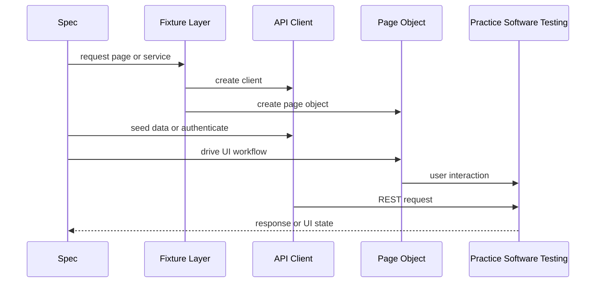
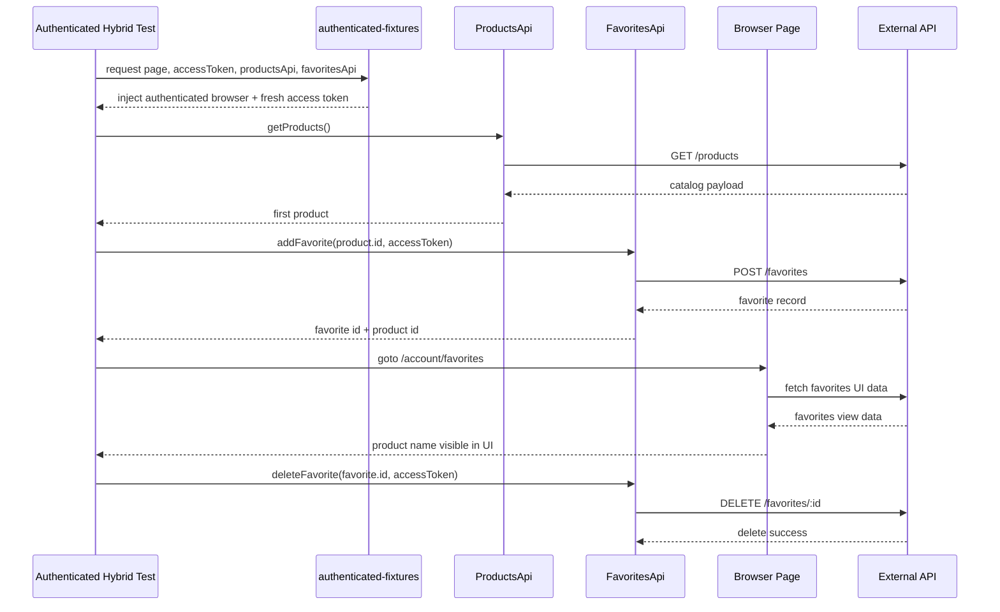
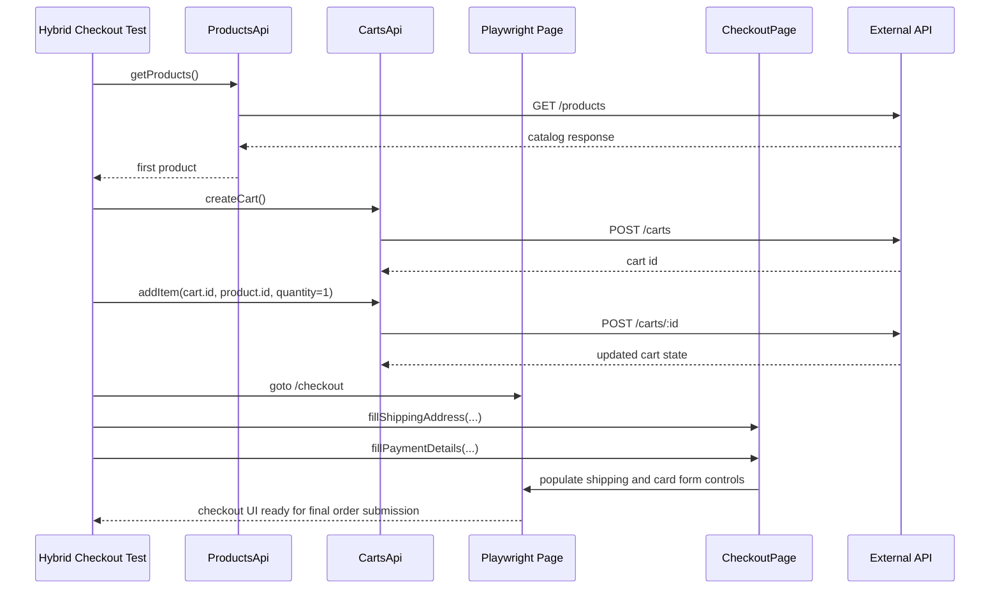
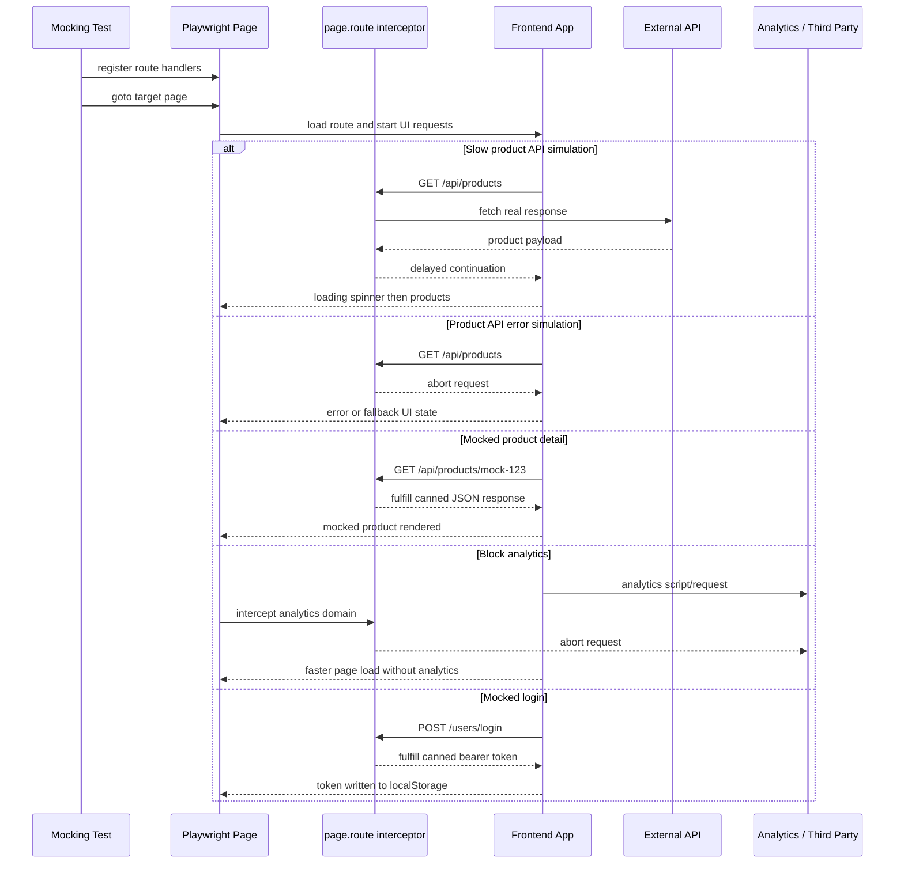
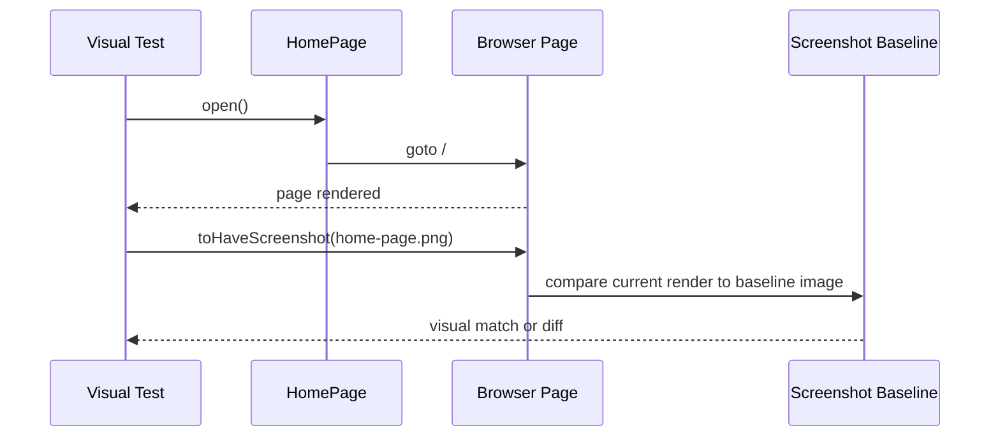

# Execution Sequences

## Live Documentation

- This document captures representative runtime sequences for the suite.
- Update it when UI workflows, authenticated setup behavior, hybrid orchestration, visual checks, or request-mocking patterns change.

## Generic Runtime Flow

## Authenticated Favorites Flow

Representative test: `tests/ui/authenticated.spec.ts`.

## Checkout Seeded Flow

Representative test: `tests/hybrid/checkout.spec.ts`.

## Request Mocking Flow

Representative test group: `tests/ui/mocking.spec.ts`.

## Visual Regression Flow

Representative test: `tests/visual/home.visual.spec.ts`.

