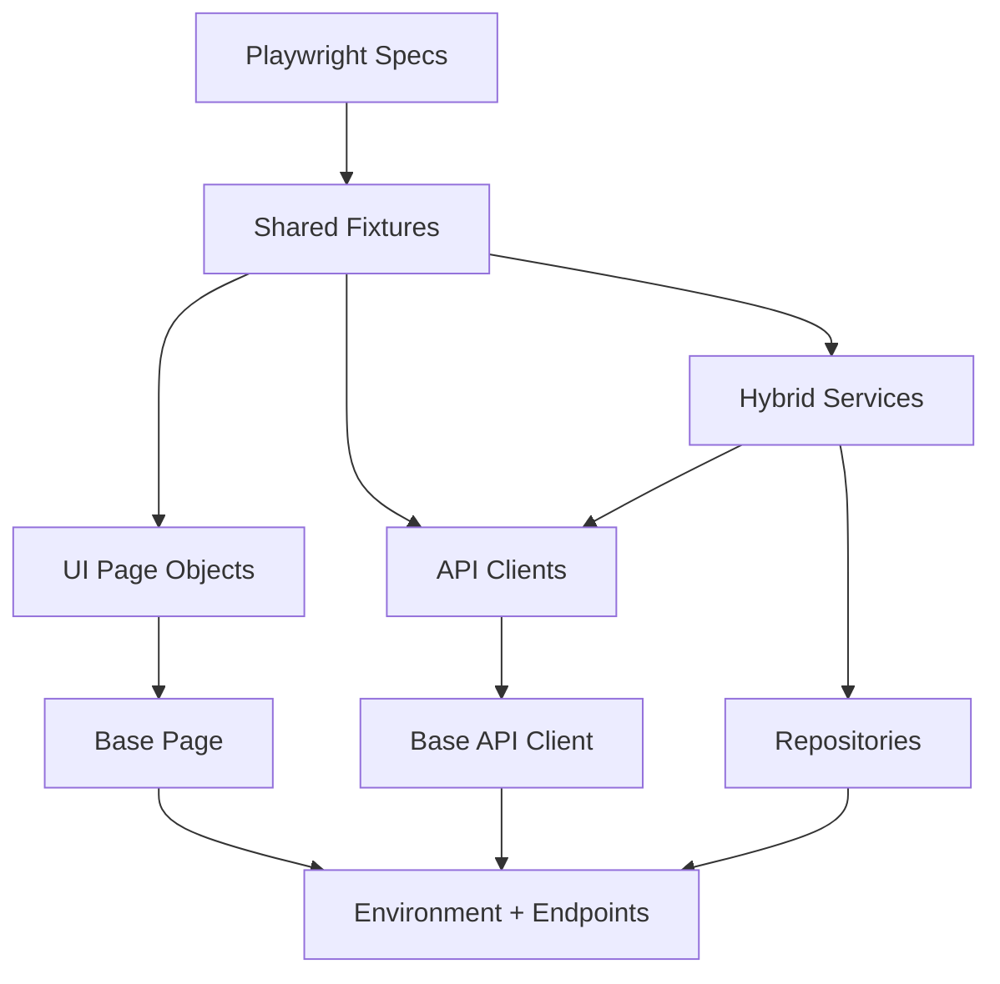
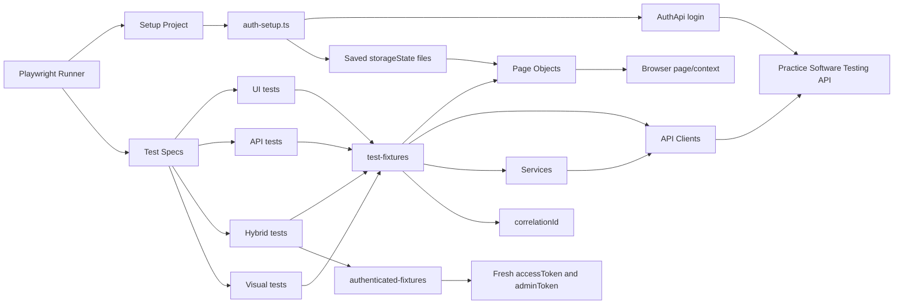

# System Architecture

## Live Documentation

- This document describes the stable framework structure: layers, runtime composition, and current dependency inventory.
- Keep it aligned with fixture wiring, page objects, service orchestration, storage-state setup, and the framework surface exposed to tests.

## Layered View

## Runtime Composition

## Current Inventory

### Page Objects And UI Components

| Page Object    | Main UI Components / Interactions                                              |
| -------------- | ------------------------------------------------------------------------------ |
| `HomePage`     | Home route, login link, search textbox, cart link                              |
| `LoginPage`    | Email field, password field, login button, logout visibility check             |
| `ProductsPage` | Products heading, search textbox, category filter text, product links          |
| `ProductPage`  | Product heading, add-to-cart button, favorite button                           |
| `CartPage`     | Cart heading, product row, quantity spinbutton, checkout button                |
| `CheckoutPage` | Shipping address fields, payment fields, place-order button, confirmation text |

### Backend Dependencies Validated By The Suite

| API Client                    | Endpoints / Behavior Validated In Current Tests                   |
| ----------------------------- | ----------------------------------------------------------------- |
| `AuthApi`                     | `/users/login`, `/users/me`                                       |
| `ProductsApi`                 | `/products`, `/products/search`                                   |
| `CartsApi`                    | `/carts`, cart item add flow                                      |
| `FavoritesApi`                | add favorite, delete favorite                                     |
| Browser-level request mocking | mocked `/users/login`, mocked product requests, blocked analytics |

Other configured clients such as `CategoriesApi`, `InvoicesApi`, `PaymentApi`, `ReportsApi`, `PostcodeApi`, `TotpApi`, `ContactApi`, and `UsersApi` are part of the framework surface and available to tests through fixtures, even when not exercised by the representative specs above.

## Data Flow

1. Environment and test data are loaded from `src/config/environment.ts` and `src/config/test-data.ts`.
2. The setup project authenticates through the backend API and saves browser `storageState` for pre-authenticated UI runs.
3. Base fixtures create API clients, page objects, services, and a shared `correlationId` for logging.
4. Authenticated fixtures extend the base fixture set and issue fresh bearer tokens when a test needs UI state and direct API access together.
5. UI tests drive page objects only, API tests call backend clients only, and hybrid tests move data from API responses into browser assertions or UI continuation steps.

## Design Principles

- Tests stay thin and describe business intent.
- Page objects own locators and UI actions.
- API clients own request/response behavior.
- Services compose multiple clients for hybrid workflows.
- Repositories provide intent-focused data access for stable test data patterns.
- Fixtures provide dependency injection without manual wiring in each test.

## Why This Works In Enterprise Teams

- It scales horizontally because tests are isolated and parallel-friendly.
- It survives application churn because locators and endpoints are centralized.
- It supports specialization because UI, API, and hybrid teams can work in separate layers.
- It is CI-friendly because config, artifacts, and reporting are standardized.
